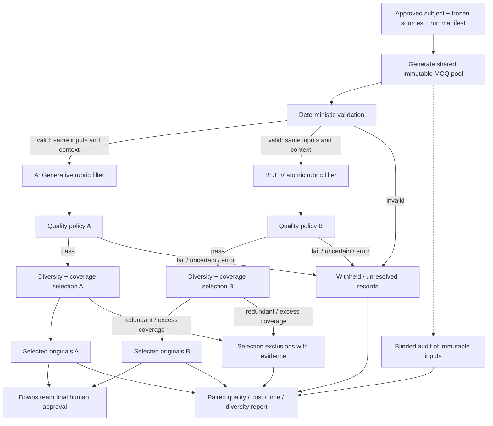
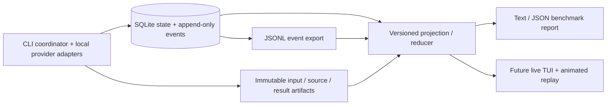

# Architecture and flow

Open [architecture.excalidraw](architecture.excalidraw) in Excalidraw using **Open** to edit the architecture and flow diagram. It depicts the proposed design, not implemented software.

All stages commit events and state to SQLite. The durable journal and immutable artifacts feed reports and a shared live/replay projection, which later drives a TUI. The audit is an experiment measurement: it includes filtered-out inputs, not just the approval queue. Humans are not expected to revise rejected questions. Only an explicit downstream human decision can approve an MCQ for use.

